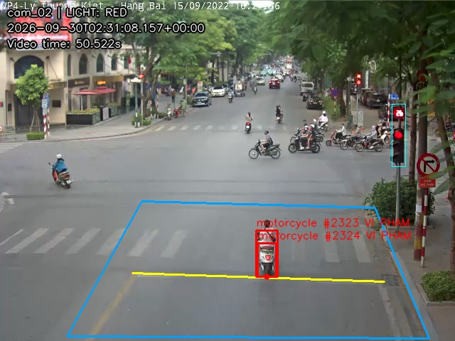

# Benchmark CPU trên hai video — 30/09/2026

Đây là benchmark **hiệu năng pipeline thật**, chưa phải benchmark độ chính xác. Không có ground truth nên số sự kiện dự đoán không được dùng làm số vi phạm đúng.

## Môi trường và phương pháp

- Windows 11, AMD Ryzen 5 4600H, 12 logical CPU; PyTorch dùng 2 luồng.
- RAM hệ thống: 7.42 GiB. Device: CPU; không đo GPU.
- Python: 3.12.14; PyTorch 2.8.0+cpu; Ultralytics 8.4.165; OpenCV 4.12.0.
- Python 3.13 của project trả Access denied trong môi trường công cụ kể cả sau khi cấp quyền đọc. Lần đo dùng Python 3.12 và nạp mã Ultralytics 8.4.165 từ bản cài local qua `--ultralytics-source`; không phải phép đo Python 3.13 hoặc bộ requirements 8.3.203 nguyên bản.
- Model xe `yolo26s.pt`; đèn `traffic_light.pt`; biển `plate_detect.pt`; EasyOCR dùng cache local. SHA-256 model, video, mã nguồn và cấu hình đầy đủ nằm trong JSON đi kèm.
- Ngưỡng đèn 0.15; xe 0.25 (candidate YOLO từ 0.1); biển 0.5; imgsz cấu hình 640; bỏ phiếu 5 frame. Giữ nguyên polygon, vạch và ROI dự phòng của cam_02.
- Mỗi kịch bản chạy 3 lần trên toàn video. Cửa sổ xem tắt; MP4/JPEG/CSV, tracking và OCR khi có sự kiện đều bật.
- Nạp model: 2.77 s; warm-up: 2.30 s, không tính vào FPS. Warm-up gồm 3 lượt đèn/xe mỗi camera, 1 lượt biển và OCR ảnh trống. OCR ảnh thật vẫn có thể có chi phí khởi tạo theo hình dạng.
- Mỗi lần chạy reset trạng thái camera. Wall time bao gồm mở/đọc video, chạy worker và đóng writer; không điều tốc theo FPS nguồn.
- Thời gian frame tính sau decode đến sau ghi frame, gồm chờ khóa và xử lý sự kiện. RSS được lấy mẫu mỗi 100 ms, không phải VRAM hay RAM toàn máy.
- Đây là phép đo trên máy làm việc, chưa cô lập tải nền hay đo hiệu năng duy trì nhiều giờ.

## Video đầu vào

| Camera | File | Kích thước | Frame | FPS nguồn |
|---|---|---|---:|---:|
| cam_01 | vid_1.mp4 | 1600×1200 | 192 | 3.016 |
| cam_02 | vid_2.mp4 | 640×480 | 384 | 6.017 |

## Kết quả toàn pipeline

FPS là số frame đã xử lý chia thời gian thực của lần chạy. Với hai camera, FPS tổng cộng frame của cả hai, không phải FPS mỗi camera.

| Kịch bản | Frame/lượt | Thời gian 3 lượt (s) | FPS 3 lượt | FPS trung vị | RSS cao nhất (MiB) | Sự kiện mỗi lượt |
|---|---:|---|---|---:|---:|---|
| cam_01 | 192 | 41.25 / 37.81 / 37.67 | 4.65 / 5.08 / 5.10 | 5.08 | 907.3 | 6 / 6 / 6 |
| cam_02 | 384 | 62.44 / 66.56 / 65.10 | 6.15 / 5.77 / 5.90 | 5.90 | 775.2 | 11 / 11 / 11 |
| cam_01+cam_02 | 576 | 106.17 / 101.88 / 103.15 | 5.43 / 5.65 / 5.58 | 5.58 | 947.3 | 17 / 17 / 17 |

Tất cả 9 lượt kết thúc thành công, số frame xử lý khớp số frame nguồn. Các số sự kiện ở bảng là đầu ra của thuật toán, chưa được gán nhãn đúng/sai.

## Thời gian từng phần

Gộp mẫu của 3 lần chạy trong từng kịch bản. Mean/p50/p95 tính bằng ms/lần gọi. Thời gian gọi model bao gồm chờ khóa; khi chạy đồng thời không phải thời gian inference thuần. Không cộng các percentile để suy ra tổng latency.

| Kịch bản | Camera / phần | Số lần gọi | Mean ms | p50 ms | p95 ms |
|---|---|---:|---:|---:|---:|
| cam_01 | camera-cam_01/frame | 576 | 195.20 | 176.28 | 289.58 |
| cam_01 | camera-cam_01/light | 576 | 23.09 | 20.68 | 33.66 |
| cam_01 | camera-cam_01/ocr | 15 | 121.80 | 105.37 | 201.81 |
| cam_01 | camera-cam_01/plate | 18 | 79.45 | 77.42 | 104.18 |
| cam_01 | camera-cam_01/vehicle_tracking | 576 | 141.92 | 131.65 | 192.31 |
| cam_02 | camera-cam_02/frame | 1152 | 167.67 | 163.21 | 233.42 |
| cam_02 | camera-cam_02/light | 1152 | 25.96 | 15.13 | 48.19 |
| cam_02 | camera-cam_02/ocr | 21 | 97.36 | 88.88 | 170.01 |
| cam_02 | camera-cam_02/plate | 33 | 52.82 | 47.32 | 77.31 |
| cam_02 | camera-cam_02/vehicle_tracking | 1152 | 133.06 | 124.86 | 178.75 |
| cam_01+cam_02 | camera-cam_01/frame | 576 | 358.95 | 335.40 | 497.52 |
| cam_01+cam_02 | camera-cam_01/light | 576 | 56.47 | 50.99 | 85.00 |
| cam_01+cam_02 | camera-cam_01/ocr | 15 | 187.71 | 142.29 | 294.74 |
| cam_01+cam_02 | camera-cam_01/plate | 18 | 177.71 | 169.12 | 241.78 |
| cam_01+cam_02 | camera-cam_01/vehicle_tracking | 576 | 246.94 | 238.24 | 329.76 |
| cam_01+cam_02 | camera-cam_02/frame | 1152 | 268.13 | 303.75 | 447.18 |
| cam_01+cam_02 | camera-cam_02/light | 1152 | 56.21 | 44.94 | 145.17 |
| cam_01+cam_02 | camera-cam_02/ocr | 21 | 132.70 | 137.12 | 183.68 |
| cam_01+cam_02 | camera-cam_02/plate | 33 | 94.39 | 85.99 | 157.42 |
| cam_01+cam_02 | camera-cam_02/vehicle_tracking | 1152 | 198.84 | 189.96 | 314.69 |

## Hai camera: tốc độ tính trên thời gian chạy chung

Hai clip có số frame và thời gian xử lý khác nhau. Camera hoàn thành sớm sẽ ngừng tranh chấp model; đây không phải tải hai luồng RTSP liên tục. Chỉ số dưới chia frame của từng camera cho toàn bộ thời gian kịch bản, không phải FPS trong riêng khoảng camera đó còn hoạt động.

| Lượt | cam_01 frame/s | cam_02 frame/s |
|---|---:|---:|
| 1 | 1.81 | 3.62 |
| 2 | 1.88 | 3.77 |
| 3 | 1.86 | 3.72 |

## Cách diễn giải và phần chưa đo

- Có thể dùng số liệu này để so sánh tốc độ xử lý của cấu hình hiện tại trên hai file. Không suy ra số camera RTSP tối đa hoặc cam kết realtime từ FPS tổng.
- Detect xe/tracking và đèn được đo trên tất cả frame; plate/OCR chỉ trên crop của sự kiện dự đoán. Hai nhánh này có số mẫu ít, hình dạng crop thay đổi; không phải benchmark OCR trên tập biển số chuẩn.
- Chưa có mAP xe/biển, precision/recall vi phạm, ma trận nhầm lẫn đèn, IDF1 hay tỷ lệ đọc đúng biển. Cần ground truth độc lập và ghép sự kiện một-một trước khi công bố các chỉ số đó.
- Chưa đo GUI, GPU, RTSP, mất mạng, frame drop hay latency từ camera vật lý. Không dùng tốc độ file nguồn làm tốc độ xử lý.

## Tái lập

Trong môi trường đã nạp được đúng các weights và có cache EasyOCR:

```powershell
.\venv\Scripts\python.exe scripts/benchmark.py --repeats 3
```

Script chạy các camera file đang enabled, từ chối RTSP để lần đo có điểm kết thúc. Kết quả gốc cùng video/bằng chứng ở `output/benchmark_<UTC>/`; không ghi vào kết quả chạy thường. Không có cache OCR hoặc thiếu model thì cần chuẩn bị trước; benchmark tắt tải tự động.

Lệnh đã dùng trong môi trường công cụ (chạy từ thư mục cha chứa `outputs` và `work`):

```powershell
.\work\venv\Scripts\python.exe outputs/red_light_violation/scripts/benchmark.py --repeats 3 --ultralytics-source outputs/red_light_violation/venv/Lib/site-packages/ultralytics
```

[Số liệu thô, môi trường, hash và cấu hình](2026-09-30-cpu.json). Trường `events` có thời gian trong video và bbox để hỗ trợ đối chiếu thủ công; không chứa kết luận đúng/sai.

## Lỗi quan sát được khi đối chiếu một sự kiện

Tại 50.522 giây của cam_02, xe máy từng bị bỏ sót đã được ghi RED và tạo sự kiện. Tuy nhiên ảnh bằng chứng cho thấy cùng chiếc xe có hai bbox/ID chồng nhau (2323 và 2324 ở lượt cam_02 đầu tiên), tạo hai bản ghi. Điều kiện chống trùng theo track ID hiện tại không loại được hai ID của cùng xe vật lý.



Đây là kiểm tra thủ công một tình huống, không phải precision/recall toàn video. Không sửa model, tracker hay ngưỡng trong quá trình benchmark để giữ điều kiện đo cố định.
